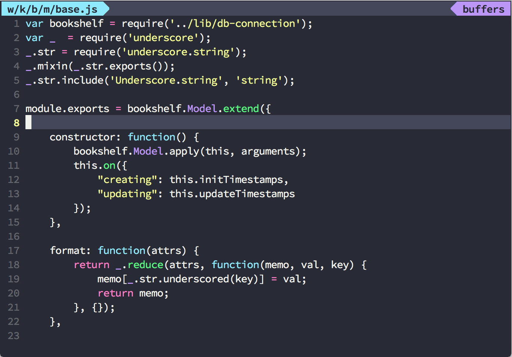

vim-dracula
===========

Dracula color scheme for Vim, original repo is hold at [https://github.com/zenorocha/dracula-theme](https://github.com/zenorocha/dracula-theme), refined highlight, compatible with [Vundle](https://github.com/gmarik/Vundle.vim).

Install
-------

[Vundle](https://github.com/gmarik/Vundle.vim)

    Plugin 'crusoexia/vim-dracula'

Usage
-----

Execute below command in your Vim or paste it into your _.vimrc_:

    colorscheme dracula

Javascript
----------

Works better with [vim-javascript](https://github.com/pangloss/vim-javascript), which provide features such as param syntax highlight.

Screenshots
-----------

